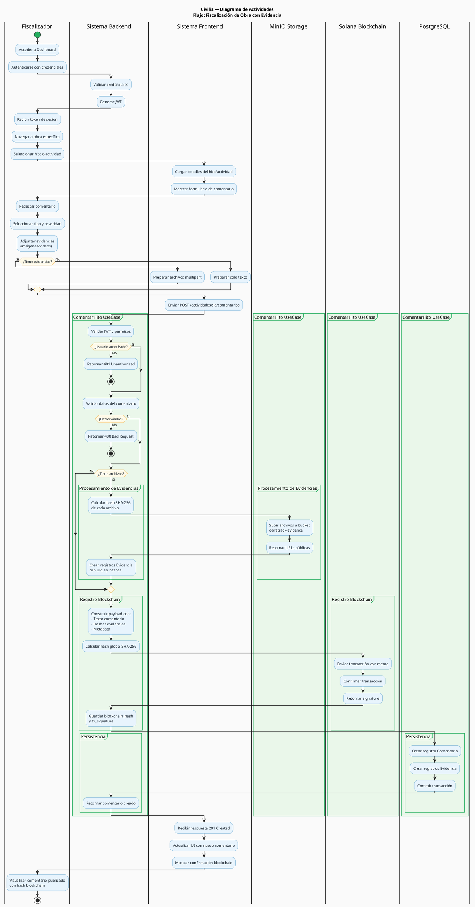

# Arquitectura de Componentes — Civilis

> "Waze de obras públicas" — Plataforma para gestión, seguimiento y auditoría de obras de infraestructura pública con trazabilidad blockchain.

---

## Diagrama de Componentes (PlantUML)

```plantuml
@startuml Civilis - Diagrama de Componentes

skinparam componentStyle rectangle
skinparam backgroundColor #FAFAFA
skinparam component {
  BackgroundColor #E8F4FD
  BorderColor #2980B9
  FontColor #1A252F
}
skinparam package {
  BackgroundColor #EAF7EA
  BorderColor #27AE60
}
skinparam database {
  BackgroundColor #FEF9E7
  BorderColor #F39C12
}
skinparam cloud {
  BackgroundColor #F9EBEA
  BorderColor #E74C3C
}
skinparam arrow {
  Color #555555
  FontColor #333333
  FontSize 10
}

title Civilis — Arquitectura de Componentes

'─────────────────────────────────────
' ACTOR / USUARIO
'─────────────────────────────────────
actor "Ciudadano" as ciudadano
actor "Fiscalizador" as fiscalizador
actor "Administrador" as admin

'─────────────────────────────────────
' FRONTEND (Next.js 15 / React 19)
'─────────────────────────────────────
package "Frontend  [Next.js 15 · Port 8080]" {

  package "Pages (App Router)" {
    [page.tsx\n(Vista pública)] as PagePublic
    [login/page.tsx\n(Dashboard)] as PageDashboard
    [layout.tsx\n(Root Layout)] as Layout
  }

  package "Lib / Servicios Cliente" {
    [api.ts\n(apiFetch + JWT)] as ApiClient
  }

  package "Types" {
    [types/index.ts\n(Interfaces TS)] as Types
  }

  Layout --> PagePublic
  Layout --> PageDashboard
  PagePublic --> ApiClient
  PageDashboard --> ApiClient
  ApiClient ..> Types : usa
}

'─────────────────────────────────────
' BACKEND (Fastify + TypeScript)
'─────────────────────────────────────
package "Backend  [Fastify · Port 3000]" {

  package "Infrastructure" {
    [server.ts\n(Rutas + DI)] as Server
    [env.ts\n(Config)] as Env
    [bootstrap.ts\n(Seed)] as Bootstrap
  }

  package "Application — Use Cases" {
    [AuthUseCase\n(Register / Login)] as UCAuth
    [CrearObra] as UCCrearObra
    [ListarObras] as UCListarObras
    [ObtenerObra] as UCObtenerObra
    [CrearHito] as UCCrearHito
    [ListarHitosObra] as UCListarHitos
    [ComentarHito\n(Upload + Blockchain)] as UCComentarHito
    [ListarComentariosHito] as UCListarComentarios
  }

  package "Domain — Entities" {
    [Obra] as EObra
    [Hito] as EHito
    [Actividad] as EActividad
    [Comentario] as EComentario
    [Usuario] as EUsuario
    [Evidencia] as EEvidencia
    [Actor] as EActor
    [ObraPlanVersion] as EPlanVersion
  }

  package "Ports (Interfaces)" {
    interface "ObraRepository" as PObraRepo
    interface "HitoRepository" as PHitoRepo
    interface "ComentarioRepository" as PComRepo
    interface "UsuarioRepository" as PUserRepo
    interface "BlockchainService" as PBlockchain
    interface "FileStorage" as PStorage
  }

  package "Adapters" {

    package "PostgreSQL (Prisma ORM)" {
      [ObraRepositoryPrisma] as AObra
      [HitoRepositoryPrisma] as AHito
      [ComentarioRepositoryPrisma] as AComentario
      [UsuarioRepositoryPrisma] as AUsuario
      [prisma-client.ts\n(Singleton)] as PrismaClient
    }

    package "Blockchain" {
      [SolanaBlockchainService] as ASolana
    }

    package "File Storage" {
      [MinioStorage\n(S3 SDK)] as AMinio
    }
  }

  ' Server → Use Cases
  Server --> UCAuth
  Server --> UCCrearObra
  Server --> UCListarObras
  Server --> UCObtenerObra
  Server --> UCCrearHito
  Server --> UCListarHitos
  Server --> UCComentarHito
  Server --> UCListarComentarios

  ' Use Cases → Ports
  UCAuth --> PUserRepo
  UCCrearObra --> PObraRepo
  UCListarObras --> PObraRepo
  UCObtenerObra --> PObraRepo
  UCCrearHito --> PHitoRepo
  UCListarHitos --> PHitoRepo
  UCComentarHito --> PComRepo
  UCComentarHito --> PBlockchain
  UCComentarHito --> PStorage
  UCListarComentarios --> PComRepo

  ' Use Cases → Entities
  UCCrearObra ..> EObra : crea
  UCCrearHito ..> EHito : crea
  UCComentarHito ..> EComentario : crea
  UCComentarHito ..> EEvidencia : crea
  UCAuth ..> EUsuario : crea/valida

  ' Ports → Adapters (implementaciones)
  PObraRepo <|.. AObra : implements
  PHitoRepo <|.. AHito : implements
  PComRepo <|.. AComentario : implements
  PUserRepo <|.. AUsuario : implements
  PBlockchain <|.. ASolana : implements
  PStorage <|.. AMinio : implements

  ' Adapters → Prisma Client
  AObra --> PrismaClient
  AHito --> PrismaClient
  AComentario --> PrismaClient
  AUsuario --> PrismaClient
}

'─────────────────────────────────────
' INFRAESTRUCTURA EXTERNA
'─────────────────────────────────────
database "PostgreSQL 15\n[Port 5432]" as Postgres
[MinIO\n(Object Storage)\nPort 9000 / 9001] as MinioSvc
cloud "Solana\n(Devnet / Blockchain)" as SolanaNet

'─────────────────────────────────────
' CONEXIONES ENTRE CAPAS
'─────────────────────────────────────

' Usuarios → Frontend
ciudadano --> PagePublic : HTTP browser
fiscalizador --> PageDashboard : HTTPS + JWT
admin --> PageDashboard : HTTPS + JWT

' Frontend → Backend
ApiClient --> Server : REST API\nHTTP/JSON + JWT

' Adapters → Infraestructura externa
PrismaClient --> Postgres : SQL (TCP 5432)
AMinio --> MinioSvc : AWS S3 SDK\n(TCP 9000)
ASolana --> SolanaNet : RPC JSON\n(HTTPS)

@enduml
```

---

## Diagrama de Actividades (PlantUML)



---

## Diagrama de Implementación (PlantUML)

```plantuml
@startuml Civilis - Diagrama de Implementación

skinparam backgroundColor #FAFAFA
skinparam node {
  BackgroundColor #E8F4FD
  BorderColor #2980B9
  FontColor #1A252F
}
skinparam component {
  BackgroundColor #FFFFFF
  BorderColor #34495E
  FontColor #1A252F
}
skinparam database {
  BackgroundColor #FEF9E7
  BorderColor #F39C12
}
skinparam cloud {
  BackgroundColor #F9EBEA
  BorderColor #E74C3C
}
skinparam artifact {
  BackgroundColor #FDFEFE
  BorderColor #85929E
}
skinparam arrow {
  Color #555555
  FontColor #333333
}

title Civilis — Diagrama de Implementación (Deployment)

'─────────────────────────────────────
' CLIENTE / NAVEGADOR
'─────────────────────────────────────
node "<<device>>\nCliente\n(Navegador Web)" as Browser {
  component [Interfaz Web\nReact 19] as WebUI
  artifact "JavaScript Bundle" as JSBundle
}

'─────────────────────────────────────
' SERVIDOR DE APLICACIÓN (Docker Host)
'─────────────────────────────────────
node "<<execution environment>>\nServidor de Aplicación\n(Docker Host)" as DockerHost {
  
  '─── Contenedor Frontend ───
  node "<<container>>\nobratrack-frontend\n:8080" as FrontendContainer {
    component [Next.js 15 Server\nNode.js 22] as NextApp
    artifact "package.json" as FrontendPkg
    artifact "src/app/**/*.tsx" as FrontendPages
    artifact "src/lib/api.ts" as ApiClient
    artifact ".next/\n(Build output)" as NextBuild
  }
  
  '─── Contenedor Backend ───
  node "<<container>>\nobratrack-backend\n:3000" as BackendContainer {
    component [Fastify API Server\nNode.js 22 + TS] as FastifyApp
    
    package "Application Layer" {
      artifact "server.ts" as ServerFile
      artifact "Use Cases" as UseCases
      artifact "Domain Entities" as Entities
    }
    
    package "Infrastructure Layer" {
      artifact "Repositories\n(Prisma)" as Repos
      artifact "Adapters\n(Solana, MinIO)" as Adapters
      artifact "prisma/schema.prisma" as PrismaSchema
    }
    
    artifact "package.json" as BackendPkg
    artifact "dist/\n(Compiled JS)" as DistFolder
  }
  
  '─── Contenedor PostgreSQL ───
  node "<<container>>\nobratrack-postgres\n:5432" as PostgresContainer {
    database "PostgreSQL 15\nDB: obratrack" as PostgresDB {
      artifact "Schema: public" as Schema
      artifact "Tables:\n- Usuario\n- Obra\n- Hito\n- Actividad\n- Comentario\n- Evidencia\n- Actor\n- ObraPlanVersion" as Tables
    }
  }
  
  '─── Contenedor MinIO ───
  node "<<container>>\nobratrack-minio\n:9000 / :9001" as MinioContainer {
    component [MinIO Server\nS3-Compatible Storage] as MinioServer
    artifact "Bucket:\nobratrack-evidence" as MinioBucket
    artifact "Archivos:\n- Imágenes (JPG, PNG)\n- Videos (MP4)" as MinioFiles
  }
  
  '─── Red Docker ───
  package "Docker Bridge Network" as DockerNetwork {
  }
}

'─────────────────────────────────────
' BLOCKCHAIN EXTERNO
'─────────────────────────────────────
cloud "<<external service>>\nSolana Devnet\n(Blockchain Público)" as SolanaCloud {
  component [Solana RPC Node\napi.devnet.solana.com] as SolanaRPC
  database "Distributed Ledger" as SolanaLedger {
    artifact "Transacciones\ncon Memos\n(Hashes inmutables)" as SolanaTxs
  }
}

'─────────────────────────────────────
' VOLÚMENES PERSISTENTES
'─────────────────────────────────────
database "<<volume>>\npostgres_data" as PgVolume {
  artifact "/var/lib/postgresql/data" as PgData
}

database "<<volume>>\nminio_data" as MinioVolume {
  artifact "/data" as MinioData
}

'─────────────────────────────────────
' PROTOCOLO DE COMUNICACIÓN
'─────────────────────────────────────
interface "HTTPS\nPort 8080" as HTTPSInterface
interface "HTTP REST + JWT\nPort 3000" as RESTInterface
interface "PostgreSQL Protocol\nPort 5432" as SQLInterface
interface "S3 API\nPort 9000" as S3Interface
interface "JSON-RPC\nHTTPS" as RPCInterface

'─────────────────────────────────────
' CONEXIONES
'─────────────────────────────────────

' Cliente → Frontend
WebUI --> HTTPSInterface
HTTPSInterface --> NextApp

' Frontend → Backend
NextApp --> RESTInterface
RESTInterface --> FastifyApp

' Backend → PostgreSQL
FastifyApp --> SQLInterface
SQLInterface --> PostgresDB

' Backend → MinIO
FastifyApp --> S3Interface
S3Interface --> MinioServer

' Backend → Solana
FastifyApp --> RPCInterface
RPCInterface --> SolanaRPC

' Volúmenes persistentes
PostgresDB --> PgVolume : monta
MinioServer --> MinioVolume : monta

' Componentes internos
NextApp ..> NextBuild : ejecuta
FastifyApp ..> DistFolder : ejecuta
FastifyApp ..> UseCases : usa
UseCases ..> Repos : usa
Repos ..> Adapters : usa

' Contenedores en red
FrontendContainer -[hidden]- DockerNetwork
BackendContainer -[hidden]- DockerNetwork
PostgresContainer -[hidden]- DockerNetwork
MinioContainer -[hidden]- DockerNetwork

'─────────────────────────────────────
' NOTAS
'─────────────────────────────────────
note right of DockerHost
  **Orquestación: Docker Compose**
  - 4 contenedores interconectados
  - 2 volúmenes persistentes
  - Red bridge interna
  - Variables de entorno inyectadas
end note

note right of SolanaCloud
  **Registro Inmutable**
  - Hashes de comentarios
  - Hashes de evidencias
  - Versiones de plan de obra
  - Trazabilidad permanente
end note

note bottom of PostgresDB
  **Base de Datos Relacional**
  - ORM: Prisma
  - Migraciones versionadas
  - Relaciones FK estrictas
end note

note bottom of MinioServer
  **Object Storage**
  - Compatible con S3
  - Almacena evidencias
  - URLs públicas accesibles
end note

note left of Browser
  **Clientes Soportados**
  - Chrome/Edge (Chromium)
  - Firefox
  - Safari
  - Dispositivos móviles
end note

@enduml
```



---

## Descripción de Capas

### Frontend — Next.js 15

| Componente | Descripción |
|---|---|
| `layout.tsx` | Layout raíz con providers globales |
| `page.tsx` | Vista pública de obras con Gantt (solo lectura) |
| `login/page.tsx` | Portal de autenticación + Dashboard completo (CRUD) |
| `api.ts` | Wrapper `apiFetch()` — agrega header `Authorization: Bearer <JWT>` |
| `types/index.ts` | Interfaces TypeScript que espeja los modelos del backend |

### Backend — Fastify (Arquitectura Hexagonal)

#### Infrastructure
| Componente | Descripción |
|---|---|
| `server.ts` | Registra rutas, middlewares CORS/JWT, inyecta dependencias |
| `env.ts` | Carga y valida variables de entorno |
| `bootstrap.ts` | Seed de datos demo (usuarios, obras, hitos, comentarios) |

#### Application — Use Cases
| Use Case | Rol | Descripción |
|---|---|---|
| `AuthUseCase` | Todos | Registro con SHA-256 + Login con JWT |
| `CrearObra` | ADMIN | Valida y persiste una obra pública |
| `ListarObras` | Todos | Retorna todas las obras |
| `ObtenerObra` | Todos | Obra por ID con actores |
| `CrearHito` | ADMIN | Crea hito/fase dentro de una obra |
| `ListarHitosObra` | Todos | Hitos de una obra |
| `ComentarHito` | FISCALIZADOR/ADMIN | Sube evidencias a MinIO, hashea archivos, registra en Solana y persiste comentario |
| `ListarComentariosHito` | Todos | Comentarios de hito o actividad |

#### Domain — Entidades
| Entidad | Descripción |
|---|---|
| `Obra` | Proyecto de obra pública (nombre, ubicación, presupuesto, fechas, estado) |
| `Hito` | Fase/etapa dentro de una obra (ordenada) |
| `Actividad` | Tarea dentro de un hito |
| `Comentario` | Observación con tipo, severidad y hash blockchain |
| `Evidencia` | Archivo adjunto (imagen/video) con URL en MinIO y hash SHA-256 |
| `Usuario` | Cuenta de usuario con rol ADMIN / FISCALIZADOR / CIUDADANO |
| `Actor` | Contratista, interventor o entidad pública vinculada a una obra |
| `ObraPlanVersion` | Snapshot versionado del plan de obra registrado en blockchain |

#### Adapters
| Adapter | Implementa | Descripción |
|---|---|---|
| `ObraRepositoryPrisma` | `ObraRepository` | CRUD de obras vía Prisma ORM |
| `HitoRepositoryPrisma` | `HitoRepository` | CRUD de hitos vía Prisma ORM |
| `ComentarioRepositoryPrisma` | `ComentarioRepository` | CRUD de comentarios + evidencias |
| `UsuarioRepositoryPrisma` | `UsuarioRepository` | Autenticación y gestión de usuarios |
| `SolanaBlockchainService` | `BlockchainService` | Registra memos en Solana Devnet vía RPC |
| `MinioStorage` | `FileStorage` | Sube archivos a MinIO usando AWS S3 SDK |

---

## Flujo de Datos Principales

### Creación de comentario con evidencia

```
Fiscalizador
  → POST /actividades/:id/comentarios (multipart)
    → ComentarHito UseCase
      ├── Hashea texto + archivos (SHA-256)
      ├── MinioStorage.upload()  →  MinIO (S3)
      ├── SolanaBlockchainService.registrarComentario()  →  Solana Devnet
      └── ComentarioRepositoryPrisma.crear()  →  PostgreSQL
```

### Visualización pública

```
Ciudadano
  → GET /obras  →  ListarObras UseCase  →  ObraRepositoryPrisma  →  PostgreSQL
  → Frontend renderiza Gantt con hitos y actividades
```

---

## Servicios Docker

| Servicio | Imagen | Puerto | Descripción |
|---|---|---|---|
| `postgres` | postgres:15 | 5432 | Base de datos principal |
| `minio` | minio/minio | 9000 (API) / 9001 (Console) | Almacenamiento de evidencias |
| `backend` | node:22-alpine | 3000 | API Fastify |
| `frontend` | node:22-alpine | 8080 | Aplicación Next.js |

---

## Roles y Permisos

| Rol | Acceso |
|---|---|
| `CIUDADANO` | Solo lectura — ver obras y Gantt |
| `FISCALIZADOR` | Crear comentarios + subir evidencias |
| `ADMIN` | Todo lo anterior + crear obras, hitos, actividades y plan versions |